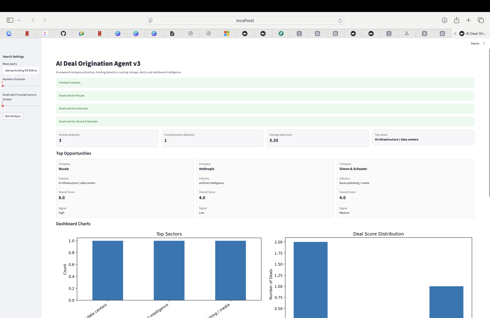

# AI Deal Origination Agent


An **AI-powered investment intelligence platform** that scans global news, extracts companies, detects funding signals, scores potential investment opportunities, and generates alerts.

This project simulates how venture capital and private equity firms **discover and evaluate new deals automatically using AI**.

---

# Dashboard Preview


```
ai-deal-origination-agent/
│
├── dashboard.png
```




---

# Overview

The **AI Deal Origination Agent** automates early-stage deal sourcing by monitoring global news sources and identifying signals that may indicate potential investment opportunities.

The system uses AI to:

- Extract companies mentioned in news articles
- Detect funding and investment events
- Evaluate investment attractiveness using scoring models
- Store deal intelligence in a database
- Trigger alerts for high-scoring opportunities
- Visualize insights through an interactive dashboard

This project demonstrates how AI can transform **unstructured news data into structured investment intelligence**.

---

# Key Features

## Automated News Intelligence

The system scans global business news using configurable queries such as:

```
startup funding OR B2B software OR SaaS OR acquisition
```

Articles are automatically retrieved and processed for investment signals.

---

## AI Company Extraction

Natural Language Processing extracts:

- Primary company mentioned
- Additional companies referenced
- Industry classification
- Geographic region

---

## Investment Event Detection

The AI identifies key business events such as:

- Funding rounds
- Acquisitions
- Product launches
- Market expansions
- Strategic partnerships

---

## Multi-Factor Investment Scoring

Each company is evaluated using several scoring dimensions.

| Metric | Description |
|------|------|
| Growth Score | Company growth potential |
| Market Score | Market opportunity size |
| Strategic Fit | Alignment with investment focus |
| Risk Score | Operational and sector risk |
| Overall Score | Aggregated investment attractiveness |

Deals are categorized into:

- **High Potential**
- **Medium Potential**
- **Low Potential**

---

## Interactive Investment Dashboard

The Streamlit interface provides:

- Real-time deal discovery
- Sector distribution analysis
- Deal score distribution charts
- Top investment opportunities
- Detailed article-level analysis
- Exportable datasets

---

## Deal Intelligence Database

All analyzed deals are stored locally allowing:

- Historical deal tracking
- Sector trend analysis
- Company monitoring
- Export to CSV for further analysis

---

## Email Investment Alerts

When a deal exceeds a configurable score threshold, the system can automatically send email alerts to analysts.

This enables near real-time monitoring of potential investment opportunities.

---

# System Architecture

```
News API
   ↓
Article Collection
   ↓
AI Analysis Engine (OpenAI)
   ↓
Company Extraction + Event Detection
   ↓
Investment Scoring Model
   ↓
SQLite Deal Database
   ↓
Streamlit Dashboard + Email Alerts
```

---

# Technology Stack

| Technology | Purpose |
|------|------|
| Python | Core application logic |
| Streamlit | Interactive dashboard |
| OpenAI API | AI analysis and entity extraction |
| News API | Real-time news ingestion |
| SQLite | Deal storage database |
| Pandas | Data processing |
| Matplotlib | Data visualization |
| SMTP | Email alert system |

---

# Installation

Clone the repository:

```bash
git clone https://github.com/YOUR_USERNAME/ai-deal-origination-agent.git
cd ai-deal-origination-agent
```

Install dependencies:

```bash
pip install -r requirements.txt
```

---

# Environment Configuration

Create a `.env` file in the project root.

```
OPENAI_API_KEY=your_openai_api_key
NEWS_API_KEY=your_newsapi_key

EMAIL_ALERTS=false
SMTP_SERVER=smtp.gmail.com
SMTP_PORT=587
SMTP_USERNAME=your_email@gmail.com
SMTP_PASSWORD=your_app_password
ALERT_TO_EMAIL=your_email@gmail.com
```

Important: `.env` should **never be committed to GitHub**.

Make sure `.gitignore` contains:

```
.env
```

---

# Running the Application

Start the dashboard:

```bash
python3 -m streamlit run app.py
```

Then open:

```
http://localhost:8501
```

---

# Example Workflow

1. Fetch latest startup and technology news
2. Send articles to AI for analysis
3. Extract company entities and investment events
4. Score investment potential
5. Store results in database
6. Display insights on dashboard
7. Trigger alerts for high-scoring deals

---

# Example Output

The system identifies companies such as:

| Company | Industry | Event | Score |
|------|------|------|------|
| Stripe | Fintech | Funding | 9 |
| Databricks | AI/Data | Expansion | 8 |
| OpenAI | AI | Product Launch | 8 |

---

# Skills Demonstrated

This project demonstrates practical skills in:

- AI workflow automation
- LLM API integration
- Natural language entity extraction
- Data pipelines
- Investment intelligence modeling
- Dashboard development
- Database design
- Email notification systems

---

# Future Improvements

Possible future enhancements include:

- Company watchlists
- Sector trend prediction
- Automated investor reports
- LinkedIn founder discovery
- Portfolio monitoring
- Real-time startup intelligence feeds

---

# Author

**Jerry Ossai Chukwunedu**

